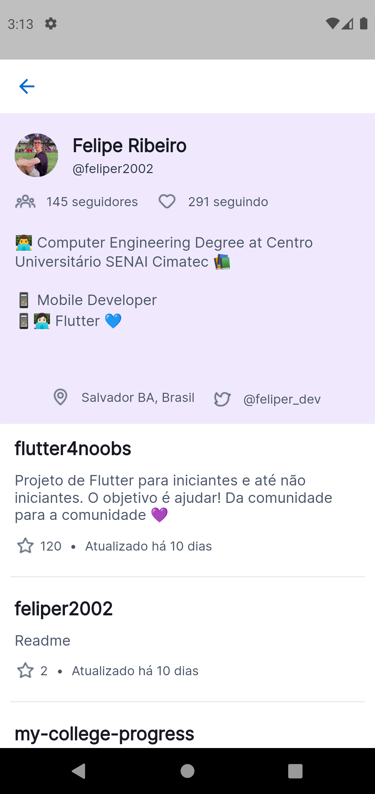

# Search d_evs

<div align='center'>
    
    
</div>

## 1. Instalando o projeto na máquina

### Clonando o projeto

1. Abra um diretório de sua preferência em sua máquina
2. Tendo o [Git](https://git-scm.com/) configurado e instalado, abra o CLI de sua preferência
3. Copie e cole seguinte comando:
```
git clone https://github.com/feliper2002/petize_teste.git
```
4. Abra o projeto na IDE ou editor de texto de sua preferência

### Instalando o Flutter

1. Siga as etapas de instalação pela [documentação](https://docs.flutter.dev/get-started/install) do Flutter de acordo com seu Sistema Operacional.
2. Configure as variáveis de ambiente de sua máquina adicionando o local de instalação do Flutter ao `PATH` do seu sistema.
3. Abra um CLI de sua preferência e execute o seguinte comando:
```
flutter doctor --android-licenses
```
4. Aceite os termos pressionando a tecla `Y` quando for solicitado.

### Configurando o Android Studio

1. Faça download do Android Studio [aqui](https://developer.android.com/studio)
2. Após instalá-lo em sua máquina, execute o programa
3. Em sua interface principal, clique na opção *Configure* (Configurações)
4. Selecione *AVD Manager*
5. Selecione o botão *Create Virtual Device* para adicionar um novo dispositivo
6. Selecione o dispositivo de sua preferência (recomendado: `Pixel 4`) e clique em próximo.
7. Selecione a API cuja o nível seja 30 (API 30), clique na opção *Download* ao lado de seu respectivo nome.
8. Após finalizar a instalação, clique em próximo.
9. Teste o funcionamento de seu emulador clicando no ícone verde semelhante a uma seta em *Actions*

### Executando o projeto

1. Vá para a IDE ou editor de texto de sua preferência e abra o projeto
2. Abra o emulador instalado
3. No CLI integrado de sua IDE ou em uma CLI aberta no diretório de seu projeto, execute o seguinte comando:
```
flutter pub get
```
4. Em seguida, execute o comando
```
flutter run
```
ou
```
flutter pub run
```

### Instalando o APK em um disposítivo

> A versão mais atualizada do APK estará disponível [nessa release]()

1. Execute em sua CLI aberta no diretório do projeto:
```
flutter build apk
```
2. Após concluir a build, o arquivo `app.apk` estará no caminho `build/app/outputs/flutter-apk/`
3. Transfira o arquivo `app.apk` para seu dispositivo móvel e instale-o para usá-lo.

## 2. Frameworks e bibliotecas

### Flutter
O Flutter foi utilizado como Framework de desenvolvimento do projeto por ser uma tecnologia cuja qual venho estudando e buscando me aperfeiçoar nela há 2 anos. Além disso, utilizá-lo neste teste é também uma forma de obter novos aprendizados com o Flutter e adquirir experiência em novos desafios.

### Bibliotecas

O **`flutter_modular`** foi utilizado para gerenciamento de rotas e para injeção e inversão de dependências.
Ressalto, inclusive, um novo aprendizado com o Flutter Modular, na utilização de um `Bind.factory()`, seguindo a própria documentação, com o objetivo de construir a instância do controller (com BLoC) em demanda para execução de dois métodos seguidos em uma mesma tela. Assim, os estados e seus resultados puderam persistir na mesma tela, sem que houvesse perda de informações.

O **`flutter_bloc`** foi utilizado como padrão de gerenciamento de estado, em específico o `Cubit` (padrão do BLoC que trabalha apenas com estados, não mais com eventos).
O motivo da escolha pelo `BLoC Cubit` foi pela sua proximidade com o `ValueNotifier` com a forma em que os estados são atualizado em questões de sintaxe.

O **`bloc_test`** foi utilizado com o objetivo de facilitar os testes específicos para o classe de controle do Cubit, permitindo uma liberdade maior para prever os estados de cada ação.

O **`mocktail`** foi utilizado para *mockar* os dados e as ações durante os testes de unidade. A escolha dele, ao invés do **`mockito`** foi apenas por experiência (apesar de possuir experiência com as duas bibliotecas).

O **`timeago`** foi utilizado na tentativa de substituir uma implementação manual para a visualização do campo `updated_at` da API do GitHub, para retorno de textos como "há x dias/meses/anos". O motivo por ter utilizado o package ao invés de uma solução manual, foi por conta do tempo, pois manipular datas para calcular principalmente meses e anos envolve demanda de um pouco mais de tempo para implementar.

O **`http`** foi utilizado para consurmir o serviço de API Rest do Github. Inclusive, foi uma opção muito boa, pois reforça a importância de convertermos os dados que chegam para as classes conhecidas pelo Dart, visto que outros packages fazem essa conversão internamente (como **`dio`** ou **`uno`**). Então foi importante para trabalhar com a função interna do dart: `jsonDecode()`.

O **`url_launcher`** foi utilizado para executar views externas (páginas/sites). Foi necessário configurar o `AndroidManifest.xml` e também o `build.gradle` para o funcionamento do package, visto que o mesmo dependia de uma versão específica do SDK do Android (AndroidSDK 33) e também da implementação de queries configurando o *schemes* para o launcher.

Por fim, o **`dartz`** foi utilizado para trabalhar com estruturas de programação funcional, em especifico o *Either*, para manipulação de erros .

## 3. Testes de unidade

O projeto consta com testes de unidade realizados ao longo de todas as suas camadas (*domain*, *infra*, *external* e *presenter*).

## 4. Arquitetura

Foi utilizado como arquitetura uma aplicação de **Arquitetura Limpa**, o [Clean Dart](https://github.com/flutterando/Clean-Dart). Divindo o módulo onde se executa as principais ações do projeto com as seguintes camadas:
- Presenter
- Domain
- Infra
- External

<div align='center'>
    
</div>

## 5. Estrutura

O projeto é dividido em 3 módulos:

- App

É o módulo *núcleo* do projeto, onde contém o Widget principal do projeto, o [AppWidget](lib\modules\app\app_widget.dart) e a classe do módulo principal, o [AppModule](lib\modules\app\app_module.dart).

- Search

Neste módulo está apenas a página onde é passado o texto como argumento para um input que, através do `Modular`, passa este argumento como parâmetro para a página de resultado dentro do *ResultModule*.

- Result

Este módulo é dividido em camadas do *Clean Dart*. É aqui onde a API do GitHub é consumida através de uma comunicação via package `http` na camada **external**, onde o JSON obtido é passado para a camada **infra** e é feita a adaptação para os respectivos *models* a fim de atender ao contrato da camada de **domain**, aplicando-os às regras de negócios.
Por fim, dentro da camada **presenter**, o Cubit (`BLoC`) é utilizado para uma classe servindo de controlador para o gerenciamento de estado dentro da aplicação ao executar os métodos implementados para obtenção dos dados do usuário do Github e seus respectivos repositórios.